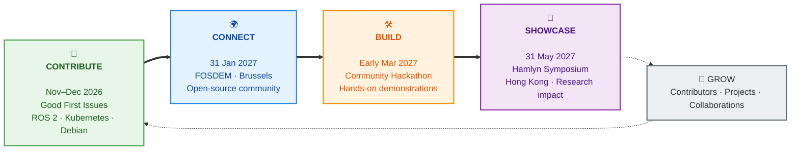

## 🌍 Community Roadmap

Building an open community through contributions, collaboration, hands-on development and research impact.

```mermaid
flowchart LR
    A["🌱<br/><b>CONTRIBUTE</b><br/><br/>Nov–Dec 2026<br/>Good First Issues<br/>ROS 2 · Kubernetes · Debian"]
    B["🌍<br/><b>CONNECT</b><br/><br/>31 Jan 2027<br/>FOSDEM · Brussels<br/>Open-source community"]
    C["🛠️<br/><b>BUILD</b><br/><br/>Early Mar 2027<br/>Community Hackathon<br/>Hands-on demonstrations"]
    D["🤝<br/><b>SHOWCASE</b><br/><br/>31 May 2027<br/>Hamlyn Symposium<br/>Hong Kong · Research impact"]

    A ==> B ==> C ==> D

    D -.-> E["🚀 GROW<br/>Contributors · Projects · Collaborations"]
    E -.-> A

    style A fill:#e8f5e9,stroke:#43a047,stroke-width:2px,color:#1b5e20
    style B fill:#e3f2fd,stroke:#1e88e5,stroke-width:2px,color:#0d47a1
    style C fill:#fff3e0,stroke:#fb8c00,stroke-width:2px,color:#e65100
    style D fill:#f3e5f5,stroke:#8e24aa,stroke-width:2px,color:#4a148c
    style E fill:#eceff1,stroke:#546e7a,stroke-width:2px,color:#263238
```
